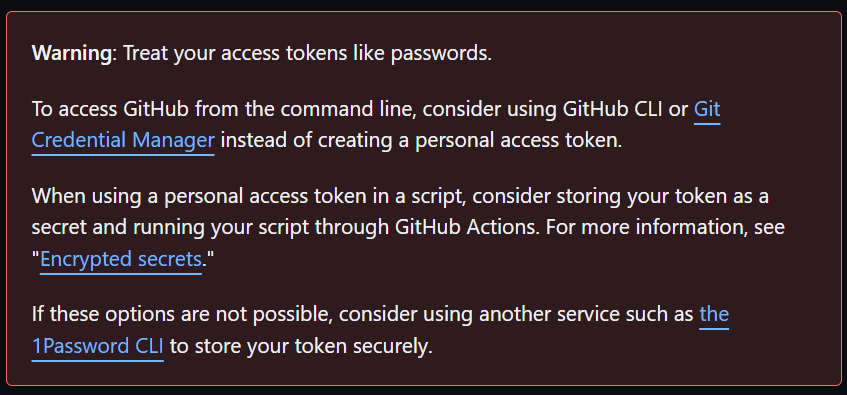
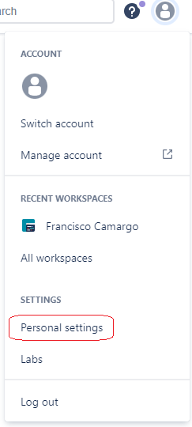
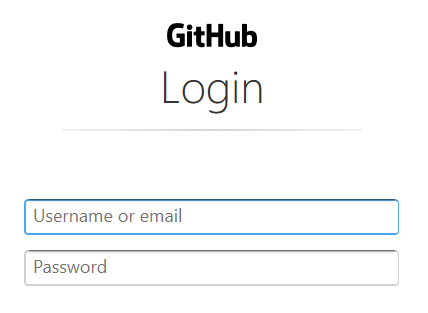
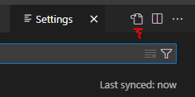
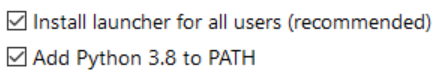
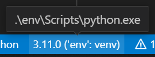
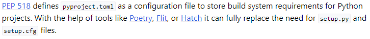

Development Workflow
====================

***Guide to setting up and using a machine for code development***

Francisco Camargo

# Abstract

This repo collects the details necessary to set up my dev workflow on a new machine.

Old: I want to learn to use Ubuntu to develop. Will do this both via the Windows Subsystem for Linux (WSL)  on one machine and from a machine with Ubuntu installed as the OS.

I also want to learn to use VSCode in conjunction with using Ubuntu.

To clone this repo:

```bash
git clone https://github.com/francisco-camargo/dev_workflow.git
```

## Core Installations

git
Python
Sublime
Spyder # entry IDE, install within the code environment if you want or install on its own
VSCode # more powerful IDE but takes time to learn

## Python related installation

update pip
ipython # not sure why I needed this at some point during dev a project... originally I did not need to have this explicitly
matplotlib
numpy
pandas
pyyaml
pytest
mypy for type hinting
[beartype](https://pypi.org/project/beartype/0.3.1/) for type hinting
logging for logging

### Machine Learning modules

scikit-learn
scipy
mlrose-hiive # gets us NumPy, SciPy and Scikit-Learn
imbalanced-learn # for imbalanced data
spark / PySpark
hydra-core # use to track experiments
hydra-zen # sold as better for scientific applications
omegaconf # used to parse yaml files, used by hydra

PyTorch

* torch
* torchvision
* torchaudio

## SQL

* SQLite
* MySQL
* DBeaver
* DataGrip

# Terminal
To print out a tree view of the current directory use the `tree` command

# Markdown

Formatting code block [guide](https://docs.github.com/en/get-started/writing-on-github/working-with-advanced-formatting/creating-and-highlighting-code-blocks), [list ](https://github.com/github/linguist/blob/master/lib/linguist/languages.yml)of available tags

Some useful tags:

|                    |                  |             |
| :----------------- | :--------------- | :---------- |
| Batchfile          | Jupyter Notebook | R           |
| BibTeX             | Makefile         | bash        |
| Click              | Markdown         | SQL         |
| CSV                | Numpy            | TeX         |
| Dockerfile         | Pickle           | Text        |
| GraphQL            | PowerShell       | TOML        |
| Ignore List        | Python           | Vim Snippet |
| JSON               | Python console   | XML         |
| JSON with Comments | Python traceback | YAML        |

<!-- 
* bash, recommended
* Batchfile
* BibTeX
* Click
* CSV
* Dockerfile
* GraphQL
* Ignore List
* JSON
* JSON with Comments
* Jupyter Notebook
* Makefile
* Markdown
* Numpy
* Pickle
* PowerShell
* Python
* Python console
* Python traceback
* R
* Shell, not recommended
* SQL
* TeX
* Text
* TOML
* Vim Snippet
* XML
* YAML 
-->

### YAML Header

[Guide](https://zsmith27.github.io/rmarkdown_crash-course/lesson-4-yaml-headers.html)

# git

I'm going to assume that you first create a repo in a remote location, and never create one locally. Assume the repo is made, the first task is thus to be able to clone it. A prerequisite to being able to clone is to have your credentials set in the local machine.

To view the info of the current repo
`cat .git/config`
In particular, this print the url of the remote repo.

## (Optional) GitHub credentials

Here are the credentials I use when working with a personal GitHub repo.

For the username I will use the GitHub "noreply" email (because... something about hiding my email) which can be found in personal settings on GitHub, [guide](https://stackoverflow.com/a/51097104/9205210).

For the password use a personal access token (PAT). It seems that in order to make use of it I need to clone the repo using HTTPS. Will create one PAT per computer.

[Guide](https://docs.github.com/en/enterprise-server@3.4/authentication/keeping-your-account-and-data-secure/creating-a-personal-access-token) on how to create a PAT. At the top of the guide there are some valuable warnings, including one on using encrypted secrets; not storing sensitive info in repos.



## (Optional) BitBucket credentials

Using a personal BitBucket account use the Username found within the "Account Settings" page of BitBucket, found within the "Personal settings" page which can be accessed by clicking on the profile icon in the top left.



For the password, use an [App password](https://support.atlassian.com/bitbucket-cloud/docs/create-an-app-password/) which you can do from the "App passwords" page within "Personal settings".

## git credentials

[Guide](https://support.atlassian.com/bitbucket-cloud/docs/configure-your-dvcs-username-for-commits/) on `git` credentials

To set credentials specific to the current repo:

```bash
git config user.name "name" 
git config user.email "email@email.com"
```

To set global credentials use:

```bash
git config --global user.name "name"
git config --global user.email "email@email.com"
```

when I do `git push` on a new machine I get the following pop-up:



I tried using my noreply email and PAT, but that did not work and instead the CLI prompted me to enter my username. I used my noreply email and got a pop-up asking for my password. I used a new PAT (created in the moment for the machine I am using), and I was able to successfully push to the remote repo.

Using this method of entering my credentials, I did not have to enter my credentials in subsequent `git push` commands!

2023-01-20: made a new PAT (previous one had expired). I get to the pop-up window (seen above), and I was able to connect via a  `git bash` terminal within VSCode by loging-in with my github email (not the no-reply one) and used my new PAT as the password

However if this is a problem. I don't want to have to enter my username and password (PAT) every time, so follow this [guide](https://www.freecodecamp.org/news/how-to-fix-git-always-asking-for-user-credentials/) or maybe [this](https://www.techiediaries.com/git/stop-git-always-asking-for-username-and-password-when-using-https/) guide and essentially run the following commands (at the moment, not sure that I've gotten any of this to work...):

```bash
git config --global credential.helper store
git config --global credential.helper cache
```

## git commands

### git diff

View of unstaged changes

```bash
git diff [filepath]
```

View staged changes

```bash
git diff --cached [filepath]
```

### Change commit message

To change the message of the last commit

```bash
git commit --amend
```

### git squash

[Guide](https://www.git-tower.com/learn/git/faq/git-squash) to using `rebase` to squash commits together. With several commits made, we can combine them into a single commit using `rebase`. For example, let's squash together the last 3 commits by running

```bash
git rebase -i HEAD~3
```

This will bring up a text editor where we choose what to do with the last 3 commits. In this case we want to `pick` or `p` the oldest commit (which will be the top one) and `squash` or `s` all the rest. Once we save this, we will be asked to provide a comment for the new commit. The text that given to start with will contain all the comments from the commits that are getting combined. Whatever remains as uncommented will be used as the commit message.

The part I don't like about this is that I have to squash commits that are local, if any of the squash commits have been pushed  to the remote repo, this won't work. If there was a way to squash commits in the remote repo I'd be able to totally clean things up, but then again, it may be for the best that the history in the remote repo can't so easily be rewritten.

The guide also describes how to "squash and merge" during pull requests in GitHub. I used this but I don't like it because after using this merge option the Network doesn't indicate that a merge was done: the branches in the network remain separate.

# Data Versioning

DVC (Data Version Control)
Guild.ai

# VSCode

Using Sync via my personal GitHub account to sync my VSCode settings across machines.

I use the **Dark+** color theme.

## (Optional) Install VSCode for WSL

[Guide](https://code.visualstudio.com/docs/remote/wsl)
Needed to have installed VSCode in the Windows side. In the Ubuntu terminal, go to the folder in which we want to work and start-up VSCode:

`code .`

There is some first-time automatic set-up but once VSCode is open, at the bottom left I see that in green it says `WSL: Ubuntu-20.04`

Alternatively: To have VSCode looking at Ubuntu go to the bottom left and click on the green box then in the pop-up at the top select `New WSL Window using Distro...`. Now when we open a terminal we should see that it is a bash terminal and we have access to the python we just installed

## VSCode Extensions

* Python
* PyLance
* (Optional) Vim
* (Optional) Learn Vim
* (Optional) Typora
  * I use the Native code block theme
* (Optional) vscode-pdf
* (Optional) Code Spell Checker
  * While cursor is on a word of interest, hit **Ctrl+.** to show spell checking options
* Docker
* Remote - SSH

## Open Settings

Open up the command pallette (**Ctrl+Shift+p**) and then choose from:

* `Preferences: Open Keyboard Shortcuts`
* `Preferences: Open Settings (UI)`
  * To then open up `settings.json` look for the `Open Settings (JSON)` button in the top right:



## VSCode Shortcuts

[Reference](https://code.visualstudio.com/shortcuts/keyboard-shortcuts-windows.pdf) of VSCode shortcuts

Command palette
**Ctrl+Shift+p**

Open file
**Ctrl+p**

Tab windows: VSCode tabs can put placed into vertical slots. To place the current tab into a certain slot, use **Ctrl+Alt+#** where **#** can be 1, 2, etc. To switch **between** tabs within the same slot, use **Ctrl+Tab**. To switch between tabs, use **Ctrl+#**.

Switch between terminal and editor:
**Ctrl+`**

Debug console:
**Ctrl+Shift+y**

In the Settings page, look for Line Number; I like to use relative line numbers because it makes it easier to navigate with Vim.

## Using VSCode Remotely

[Guide](https://medium.com/@christyjacob4/using-vscode-remotely-on-an-ec2-instance-7822c4032cff)

# Vim

## (Optional) Install Vim on Linux

Commands to install Vim to be used within the terminal

```bash
sudo apt update
sudo apt install vim
```

## Vim on VSCode

If you use VSCode you can also use Vim via the **Vim** extension, and you can learn Vim via the **Learn Vim** extension. The **Learn Vim** [book](https://www.barbarianmeetscoding.com/boost-your-coding-fu-with-vscode-and-vim/dedication/), and [reference](https://www.barbarianmeetscoding.com/boost-your-coding-fu-with-vscode-and-vim/cheatsheet) of Vim commands.

[Guide](https://hoitz.medium.com/improved-vim-setup-in-visual-studio-code-bc579501b80c) on how to customize Vim keybindings within VSCode.

## Vim Commands

### Normal Mode

* Get into command mode: `esc`
* Enter Insert mode: `i`
* Enter Insert mode one character ahead: `a`
* Enter Visual mode: `v`
* Enter Command mode: `:`
* Moving the cursor
  * Move up: `k`
  * Move down: `j`
  * Move left: `h`
  * Move right: `l`
* New line
  * Below and enter insert mode: `o`
  * Above and enter insert mode: `O`
* Search and replace

[Guide](https://phoenixnap.com/kb/cut-copy-paste-vim)

* Copy
  * Everything to the right: `y$`
  * (Almost) everything to the left: `y^`
  * Entire line: `yy`
  * Word with its trailing whitespace: `yaw`
  * Word without its trailing whitespace: `yiw`
  * `yfx`
  * `ytx`
* Past
  * `P`
* Cut
  * Current line: `dd`
  * Everything to the right: `d$`

### Visual Mode

This is the mode used to highlight text, [guide](https://phoenixnap.com/kb/cut-copy-paste-vim).

* Highlight current word: `viw`

# Python

## Install Python on Windows

[Link](https://www.python.org/downloads/) to download Python.

During installation, be sure to add Python to PATH:



Check the version of Python. Note that it can have different aliases, e.g. `python`, `py`, `python3` etc.

```bash
python --version
>>> Python 3.11.0
```

If you use VSCode, be sure that the desired Python Interpreter is used: from the Command Pallette search for `Python: Select Interpreter`. Can check the bottom right of the window:



## Install Python on Ubuntu

We do want to install python within WSL: [guide](https://computingforgeeks.com/how-to-install-python-on-ubuntu-linux-system/)

give an [alias](https://askubuntu.com/questions/320996/how-to-make-python-program-command-execute-python-3?newreg=a3ae2d11b44641baba3120c0f6ca6111)
`alias python = python3.10`

## Python Code Environment

Download and install Python from [link](https://www.python.org/downloads/)

To create an environment via the terminal, use
`python -m venv env`

To activate environment, use
`env/Scripts/activate`

To update `pip`, use
`python -m pip install --upgrade pip`

To install libraries, use
`pip install -r requirements.txt`

To deactivate an active environment, use
`deactivate`

## Importing local code from other directories

Assume you have the following folder structure:

```shell
parent
	scriptE.py
	folder1
		scriptA.py
		scriptB.py
		folder3
			scriptF.py
	folder2
		scriptC.py
		scriptD.py
```

If you are in `scriptA.py` and

* want `scriptB.py`, use `import scriptB`
* want `scriptF.py`, use `import folder3.scriptF`
* want `scriptE.py`, you _must_ use the `from` syntax; `from ..scriptE.py import *`
* want `scriptC.py`, use `from ..folder2.scriptC`
  Note that this was tested using VSCode.

## Code Format

guide for using `black` and `flake8` and `isort` in a `pyproject.toml`, also talks about using a `.pre-commit-config.yaml` file.

`black` [guide](https://medium.com/@josephlyu.sj/python-auto-formatter-autopep8-vs-black-and-some-practical-tips-e71adb24aee1)

Code formatting shortcut in VSCode **Alt+Shift+f** or look for `Format Document` in the command pallette

Gonna go with `black`, [guide](https://black.readthedocs.io/en/stable/getting_started.html). Add it to `requirements.txt`
Run `black` by running

```bash
black {source_file_or_directory}...
```

This worked right away. However I'm not a fan of using double-quotes instead of single quotes, so one option is to pass `--skip-string-normalization` in the command line or to insert it into the settings, [guide](https://sbarnea.com/lint/black/)

* linting
* flake8

## docstrings

[guide](https://www.programiz.com/python-programming/docstrings)
[guide](https://stackoverflow.com/questions/3898572/what-are-the-most-common-python-docstring-formats) to popular docstring formats

## Running Python code in VSCode

To use the IPython terminal, install IPython
```bash
pip install ipython
```

Then in the VSCode terminal run

```bash
ipython
```

need to load (once) the `%autoreload` extension, [guide](https://ipython.readthedocs.io/en/stable/config/extensions/autoreload.html),

```Python
%load_ext autoreload
```

now can use `%autoreload`

```Python
%autoreload
%run main.py
```

I was able to run both of these lines together in the VSCode terminal by using **Ctrl+o** in the terminal to have multiple lines of input.

This will have the same effect as clicking **Run** within Spyder on whatever Python file Spyder has open. This also has the benefit of seeing changes to the code while still in IPython, which is not working when using the "import main" approach.

(old) and then within the IPython terminal that has now been instantiated, import the module you want to use

```Python
import main; main.main()
```

## Using `setup.py`

The [documentation](https://black.readthedocs.io/en/stable/usage_and_configuration/the_basics.html) for `black` suggests that we can use a `pyproject.toml` file to replace both `setup.py` and `setup.cfg` files.



## Packaging

Learn how to package code, there are several options, so first want to just look at all of them before picking one to run with

[Guide](https://stackoverflow.com/questions/1471994/what-is-setup-py)

[Guide](https://packaging.python.org/en/latest/guides/distributing-packages-using-setuptools/#configuring-your-project)

[Guide](https://godatadriven.com/blog/a-practical-guide-to-using-setup-py/), in it, they say: nowadays the use of setup.py is discouraged in favour of pyproject.toml together with setup.cfg. Find out how to use those [here](https://godatadriven.com/blog/a-practical-guide-to-setuptools-and-pyproject-toml/).

Poetry also does a similar thin? [webpage](https://python-poetry.org/) Sounds like poetry also does dependance management, so maybe use it instead of `venv`? [Poetry intro](https://youtu.be/0f3moPe_bhk) from ArjanCodes, who seems happy with it. Sounds like it can help with package publishing.

What the heck is a wheel?

## Plotting

I can plot out-of-the box to a pop-up window in VSCode if I use Run, but if I use ipython to run the code, I can't seem to be able to get the plots.

In `./src/plotting.py` I placed sample code for a plotting function that handles the aesthetics well. It Accounts for; uncertainty bands, `.eps` formatting, size of plot for two column paper, and several other minor details.

## Data Validation
[Pydantic](https://www.youtube.com/watch?v=zN4VCb0LbQI)

## Pandas

### Data Types for DataFrames
[Guide](https://youtu.be/-tU7fuUiq7w)
[Guide](https://towardsdatascience.com/validate-your-pandas-dataframe-with-pandera-2995910e564)

### `df.apply()`

[df.apply()](https://www.geeksforgeeks.org/apply-function-to-every-row-in-a-pandas-dataframe/)

### `SettingWithCopyWarning`

[Guide](https://realpython.com/pandas-settingwithcopywarning/), simple explanation on how to deal with this. First line of defence: use `.loc` and `.iloc`

```Python
df.loc[idx_label, col_label] = some_new_value
```

I think `idx_label` then just needs to be an element found within `df.index()`.

Alternatively, you could use a mask. By example:

```Python
mask = df[column_label]==some_value
```

This returns a mask of boolean values to pick out rows. Now use this mask instead of `idx_label`

```Python
df.loc[mask, col_label] = some_new_value
```

## SciKit-Learn

Want to be able to use sklearn without having to switch back and forth between numpy arrays and dataframes. Use [sklearn-pandas](https://github.com/scikit-learn-contrib/sklearn-pandas). I have successfully used this in `make_features.py` within the `dsc_roadmap` project; import `DataFrameMapper` and use it in conjunction with the sklearn `SimpleImputer`.

### ShuffleSplit
[StackOverflow](https://stackoverflow.com/questions/34731421/whats-the-difference-between-kfold-and-shufflesplit-cv#:~:text=As%20your%20data%20set%20grows,ShuffleSplit%20is%20an%20attractive%20option.) on why ShuffleSplit is useful when training data grows large

## Experimental Setup

[Guide](https://hydra.cc/docs/intro/) into how to use Hydra to help run experiments using Python.
[Video](https://youtu.be/tEsPyYnzt8s) intro
[Video](https://www.youtube.com/watch?v=bNGu8A6F3-8), mentions integration with mlflow around 20min mark, talks about parallelization (26min mark)
[Video](https://www.youtube.com/watch?v=3gk9CvMOdzE) for hydra-zen

## Model based testing

There is the `hypothesis` python package. [Docs](https://hypothesis.readthedocs.io/en/latest/), [demonstration](https://youtu.be/-S3BFkNn0rQ)

# LaTeX

To work on a `.tex` document, first install [LaTeX](https://miktex.org/download) and then install an editor, I prefer [TexMaker](https://www.xm1math.net/texmaker/)

```TeX
$y=mx+b$
```

$y=mx+b$

## Bibliography

Add the new citation to the `.bib` file.

If you don't see the bibliography right away when you compile the document, run "Quick Build" a couple times, followed by "BibTeX" mode once, followed by "Quick Build" mode one or two more times.

# (Optional) Using WSL

## Install WSL

[Check](https://www.zdnet.com/article/windows-10-tip-find-out-if-your-pc-can-run-hyper-v/) if your PC can run Hyper-V
[Guide](https://www.omgubuntu.co.uk/how-to-install-wsl2-on-windows-10)

## Install Ubuntu in WSL

Go to the Microsoft Store and install Ubuntu 20.04 (or whatever version you want).

## Where is this repo once it is cloned?

Where is this repo in my local? I can get to it from the Ubuntu terminal using

`cd dev_workflow`

or

`cd /home/francisco/dev_workflow`

In Windows I can find it at

`\\wsl$\Ubuntu-20.04\home\francisco\dev_workflow`

## Terminal Shortcuts

* New terminal tab: **ctrl+shift+t**
* New terminal window: **ctrl+alt+t**
* Switch to a specific tab: **alt+[tab #]**
* Close current tab (or window): **ctrl+shift+w**
* Copy: **ctrl+shift+c**
* Paste: **ctrl+shift+v**
* But how to I highlight text? What to do the equivalent of the Windows **ctrl+shift**+[arrow]

## Ubuntu Shell commands

* Make a directory: `mkdir [directoryname]`
* New file: `touch [filename.extension]`
* Check contents of file (?): `cat [filepath]`

## Testing

### TSLgenerator
The [TSLgenerator](https://github.com/alexorso/tslgenerator) tool helps convert domain boundaries of a problem into a suite of unit tests.

Example source code file that dictates CLI for this application on [MacOs](https://github.com/alexorso/tslgenerator/blob/c04cda8578251a6035f9a160c896f1f91b6dde85/MacOSX/main.c#L60).

Example of running the application on Windows:


