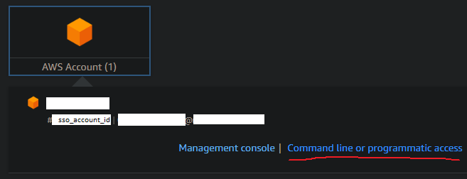
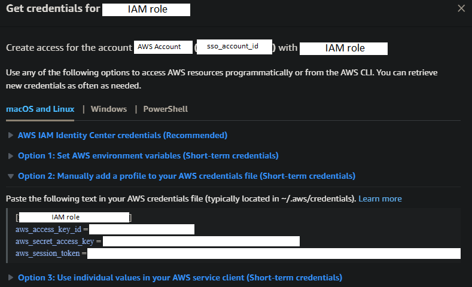

AWS CLI
=======

[Return to top README.md](../../../README.md)

# Docker Image

[link](https://hub.docker.com/r/amazon/aws-cli)

# Install AWS CLI

[link](https://docs.aws.amazon.com/cli/latest/userguide/getting-started-install.html)

verify with

```bash
aws --version
```

# Configure

In local machine have to have a `config` and a `credentials` file. Will live within the `~/.aws` directory; [guide](https://docs.aws.amazon.com/sdkref/latest/guide/file-location.html).

## `config`

Use the aws [configure wizard](https://docs.aws.amazon.com/cli/latest/userguide/sso-configure-profile-token.html#sso-configure-profile-token-auto-sso) to setup the `config` file

```bash
aws configure sso
```

Another [guide](https://dev.to/slsbytheodo/understand-the-aws-sso-login-configuration-4am7)

## `credentials`

The credentials info will be shown to us in the SSO page:



Click on "Command line or programmatic access"

"Option 2" let's you copy the necessary credentials information which can than me pasted into the `~/.aws/credentials` file



I don't understand when this information is needed... I have commented out these values from within my `credentials` file and yet working with a CodeCommit repo seems to work fine

# Log In

To login

```bash
aws sso login
```

If you would like to use a particular profile, use the `--profile` option

To know which profile you are using, run

```bash
aws sts get-caller-identity
```

There is also

```bash
aws configure list
```

There is also

```bash
aws configure list-profiles
```

# CodeCommit

After installing `git`, install `git-remote-codecommit`

[Guide](https://docs.aws.amazon.com/codecommit/latest/userguide/setting-up-git-remote-codecommit.html)

To clone from CodeCommit

```bash
git clone codecommit::<region>://<cli profile>@<repo name>
```

which will thus require the corresponding `<cli profile>` to be defined within `config`. Be sure that the CLI profile I want to use has `region` set to the region of the code repo I want to clone

or

```bash
git clone codecommit::<region>://<repo name>
```

which I think uses the default AWS CLI profile, so just means that the default profile has to have all the info needed
